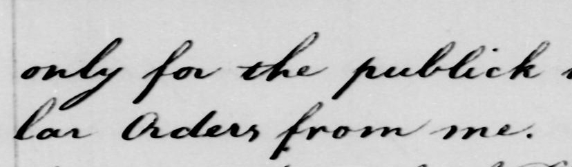
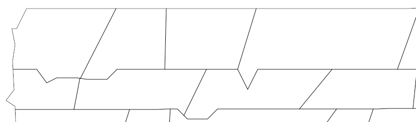
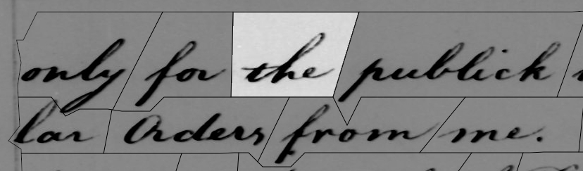
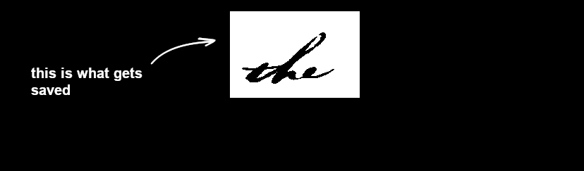
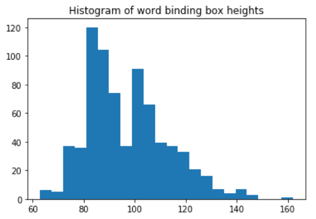
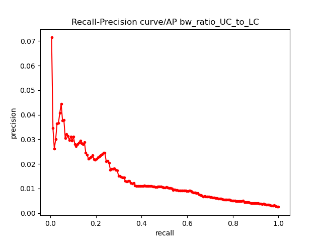
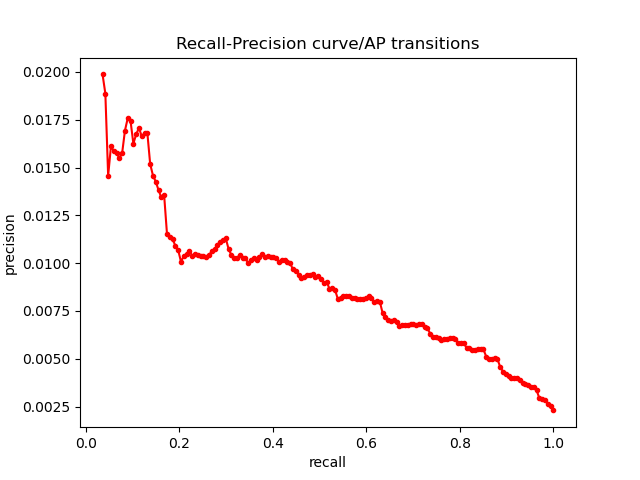
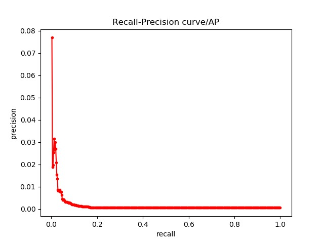

Helpful links:  
https://towardsdatascience.com/dynamic-time-warping-3933f25fcdd  
https://stackoverflow.com/questions/22588074/polygon-crop-clip-using-python-pil  
https://machinelearningmastery.com/roc-curves-and-precision-recall-curves-for-classification-in-python/  
## Dependencies
`numpy`
`svgwrite`
`svgpathtools`
`matplotlib`
`os`
`glob`
`cv2`
`skimage`
`PIL`
# Keyword Spotting using Dynamic Time Warping (DTW) in Historical Manuscripts
The goal is to digitizing historical manuscripts for cultural heritage preservation. As there are many historic writing styles and languages, the keyword spotting approach is used. Single words are detected and extracted in the scan. This allows to group toghether reoccuring words, allowing us to decipher multiple occurences of a word at once. To calculate the similarity between the words, we use the dynamic time warping (DTW) distance, which uses a sliding window approach in the direction thw word was originally written by hand. The intuition why this should work better than just calculating the distance between all pixels, is that the letters of two two occurences of the same word are all in the same order, but are stretched differently in the writing direction, with varying distances between the letters. 

E.g.

    Without DTW:       With DTW:  
    
    [Historical ]      [Historical]  
     | | | | | |        | \ \ \ \ \   
    [H istorical]      [H istorical]  

As we can see, the DTW approach allows us to match the corresponding letters, and calculates a much smaller distance between the two words.
The dataset is `WashingtonDB` and contains letters of George Washington from the 18th century, as well as usefull annotations: 

*  `/ground-truth/transcription.txt` Character based transcription

* `/ground-truth/locations/*.svg` Polygons of word segment
    
*  `/images/*.jpg` The page images
    
* `/task/Keywords.txt` Words that are contained in the training an validation set 

# Preprocessing
The dataset provided contains a map with cutouts for each word. The format of cutouts is in a scalable vector graphic (SVG).
Each word in the letter has a corresponding line in the SVG file. For page 270 there are 221 words transcribed. Word number 
10 on page 270 for example is "the", has the code and transcription `270-03-03 t-h-e`. The SVG path is given by the line:  
`<path fill="none" d="M 712.00 413.00 L 749.00 292.00 L 570.00 292.00 L 567.00 413.00 Z" stroke-width="1" id="270-03-03" stroke="black"/>`
  
The letter codes mean the following:  
`M` "move to": the starting point of the path  
`L` "line to": to which coordinates a line is drawn to  
`Z` "close": close the path  
`id`: same code as is found in the transcript file  

Each of the coordinates represents one of the edges of our polygon.

We then cut out the word from the scanned image using the polygon binding box, and apply the polygon as a mask to cut out neighboring words. The file is binarized using the Otsu method.

To normalize the image sizes we calculated the mean width (232.29px) and height (96.84px) of all resulting word images. We decided to fix the height of the words but keep the original width, as the DTW can take care of this. If we look at the histograms. We chose 120px as the height as it contains a large part of the image set and the outliers won't get squeezed too much.

# Calculating the features

The feature calculation is implemented in `store_features.py`. For every word we calculate the following features: 

* UC: upper contour
* LC: lower contour
* b/w-ratio: ratio of white to black pixels
* b/w ratio between UC/LC: b/w ratio only considering the pixels between UC and LC
* center of black pixels (center of mass)
* transitions: transitions from white to black

The results are stored as a dict and dumped in `dictPickle.bin` The resulting file size for 3700 words is 73MB, the runtime is quite short, under 5 minutes. 

# Classifier

We decided to do a simple classifier that consists of a sorted List and a treshold value K. The list is sorted in an ascending order, and K determines the number of entries from the top, that get assigned to the class. In this case K means that the K shortest distances are going to be considered "hits" by the classifier.

# DTW and evaluation

The `dictPickle.bin` file is loaded again into `dtw_and_evaluation.py`, where the DTW distance from the first occurence of every word in the `keywords.txt`file in the validation set to all images in the test set is calculated. This distance is calculated for all of the six features. 

Also, the file 'transcription.txt' is loaded in order to find the keyword corresponding to the keyword label, and the file 'train.txt' in order to identify the words in 'transcription.txt' that belong to the training set.  

Then, for every feature, a list is created with all distances (ordered), one with all corresponding image labels (i.e. ordered in the same way) and with all corresponding keywords (also ordered in the same way). Those lists are used to 
1) calculate the number of false negatives(FN), false positives (FP) and true positives (TP) in the very beginning (i.e. when only the best distance is considered as a match), and
2) to calculate the change of the number of FN, FP and TP when an additional distance is considered as a match. More distances are considered until there are no FN anymore (i.e. we achieved a recall of 100%).

The precision and recall are calculated for each step (i.e. for each number of distances considered as a match).

The number of distances used to achieve the max precision and the max recall are printed.
The plot is then drawn using the maximum precision as starting point (if multiple precisions are achieved for the same recall, only the first one is used for the plot).

Down below are the results for each feature.

 | 
-----------------------------------------------|--------------------------------------------------
  | 
  | 

As we can see in our Feature-Curves, there is basically no middle ground for our Classifier, extremely high K values are needed to get a high Recall value. At the same time an extremely low K value is needed to mantain any sort of precision. This basically means, that we can't really properly detect any true matches using only one feature.

We also tried to merge and normalise our features to see if the combination of our features nets different results, which you can see below:

This test result also didn't seem very promising, as no significant improvement could be achieved.

# Reasons for poor Performance

possible reasons for the poor performance could be the lack of normalisation of the cut-out images. Only changes made were to make each of rectangular shape of size 120xLength. Another problem is that we are not sure if our DTW is calculating the distances as intended. We tried different parameters for the sakoe-chiba band but yielded similar results. We also run it without a restrictional band at all without improvements.

Something we also realised is that, our programm sees a point or a comma after/infront of the word as a false hit. By allowing such hits to be correct, a higher precision should be achievable.

Another possible reason would be the chosen classifier, which seems to not be quite appropriate for the task. With more time we would probably have tried to implement some sort of KNN classifier using euclidean distances as a next step.

# What we can improve

This was the first "large" group project for us; which means we did run into a bunch of problems while we worked on it. Most problems were tied to us starting work quite late in the time window - which caused us to split the work too much in between people. The consequence of this was that everyone had a very narrow focus on a specific task, which turned out to be too narrow - we had trouble keeping an eye on the big picture until the last couple of zoom-meetings. At this point we had already ran out of time to make major adjustments, which would be necessary to improve our results. So next time we have a comparable project, we will put more of an emphasis on working together on each step instead of trying to piece everyone's work together in the end like a puzzle.
